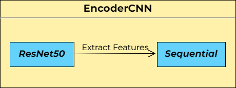

[](https://classroom.github.com/a/sPgOnVC9)
[](https://classroom.github.com/online_ide?assignment_repo_id=11106514&assignment_repo_type=AssignmentRepo)

---

# XNAP-Image Captioning
**The goal of this project is to build a model that generates a caption from an image.**

We implemented a Seq2Seq architecture, which consists of an Encoder and a Decoder. The Encoder uses the pre-trained Convolutional Neural Network ResNet50 to extract the relevant features of the images, which are then passed to the Decoder, which uses a Recurrent Neural Network (an LSTM, in particular), together with an attention mechanism, to produce the captions.

The neural net uses an attention mechanism to focus on the important information for each word, which can be visualized.


The base code comes from this [Kaggle Notebook](https://www.kaggle.com/code/mdteach/image-captioning-with-attention-pytorch), by Abishek Bashyal, and the goal of this project is to implement in an ordered way all the necessary functions and classes in Python files, as well as to throughouly document and evaluate the main mechanisms behind the implemented Seq2Seq architecture. Also, we provide an optimized version of the code, much faster and with carefully chosen hyperparameters.

## Model overview
The Seq2Seq architecture has two main layers, as we already mentioned, Encoder and Decoder. We will explain each layer and its composition in detail.

### Preprocessing
See `transforms` in [main.py](https://github.com/DCC-UAB/xnap-project-matcad_grup_10/SRC/main.py).

Prior to any of these there is the preprocessing of the [dataset](https://github.com/DCC-UAB/xnap-project-matcad_grup_10#Data). The given data, as we explain later, consists of a picture in jpg format and 5 captions for each one. 

Firstly we need to tokenize the captions to create a vocabulary for the model. It is also necessary to process the captions as numbers, which is the computer's language. Special tokens are also added: start of sentence `<SOS>`, end of sentence `<EOS>`, unknown `<UNK>` and padding `<PAD>` (to make all input captions the same length).

Images also need to change its format in order to be used in the ResNet50, ResNet152, GoogleNet or VGG, which has to be `(224, 224)`, so they experience size transformations to fit into this format. There are 2 possible transformations to be done in the [main.py](https://github.com/DCC-UAB/xnap-project-matcad_grup_10/SRC/main.py), direct resize or resize and random crop. The first one is faster, but it streches or flattens the images, which can be harmful for the model. The second option respects the proportions but crops the outer part to fit a square `(224, 224)`. 


Images are also normalized using ImageNet's mean and standard deviation values:

```
mean = [0.485, 0.456, 0.406]
std = [0.229, 0.224, 0.225]
```

### Encoder
See `EncoderCNN` in [models.py](https://github.com/DCC-UAB/xnap-project-matcad_grup_10/SRC/models/models.py).

The first layer, responsible of extracting the main features out of the image, uses a pre-trained net such as ResNet50, ResNet152, GoogleNet or VGG, which will be then transformed in a sequential net. We use the nets as they are, no gradient changes for the trained weights.



The sequential net sets the right format to the data extracted by the previous net, in order to be used in the Decoder.

### Attention
See `Attention` in [models.py](https://github.com/DCC-UAB/xnap-project-matcad_grup_10/SRC/models/models.py).

The Attention mechanism defines weights for some sectors of the image depending in the sequence so far and the word that has to be predicted next. These weights are known as `Context Vector`.


### Decoder
See `DecoderRNN` in [models.py](https://github.com/DCC-UAB/xnap-project-matcad_grup_10/SRC/models/models.py).

This is the most complex layer, it is responsible of converting all the information extracted by the encoder and the attention mechanism into a comprehensible string sequence aka **Caption**. In the training stage we use the embedded captions to fit the weights of the LSTM and Fully Connected Layer.

The LSTM is a Recurrent Neural Network that uses prior information in order to generate a new value thanks to the hidden state, an additional output generated in each step. It is able to use gramatical context and to make semantically correct sentences.


## Code structure
The code structure is as follows:
- environment.yml: Includes the code dependencies
- /SRC: Contains the source code files
  - main.py: Starting point of the code
  - train.py: Contains the train functions
  - test.py: Contains the test function
  - EDA.ipynb: Notebook with exploratory visualizations of the data
  - Visualization.ipynb: Notebook with visualization of the model
  - /models: Custom library
    - models.py: Contains the models used in the project
  - /utils: Custom library
    - utils.py: Includes utility functions used throughout the codebase
    - visualizations.py: Includes visualization functions used in the notebooks

## Data
The database used to train the model comes from this [Kaggle Dataset](https://www.kaggle.com/datasets/adityajn105/flickr8k), by Aditya Jain, which contains +8k images from the social network Flickr with 5 captions per image. The images represent diverse situations, from kids playing in a playground to landscapes. In order to have a deeper understanding of the used data please check the [Exploratory Data Analysis](https://github.com/DCC-UAB/xnap-project-matcad_grup_10/blob/main/SRC/EDA.ipynb).


## Execution
In order to execute the model it is necessary to generate it. We will do a basic step by step for the installation and execution of the code and the model.

### Installing the environment
Before running the code you have to create a local environment with conda and activate it. The provided [environment.yml](https://github.com/DCC-UAB/xnap-project-matcad_grup_10/environment.yml) file has all the required dependencies. Run the following command: ``conda env create --file environment.yml `` to create a conda environment with all the required dependencies and then activate it:
```
conda activate xnap-example
```

There is an additional package that has to be installed manually, which will allow the model to embed the captions. In the same terminal where we ran the previous commands we have to execute the next line:
```
python -m spacy download en_core_web_sm
```

And finally it is necessary to have an account in [Weights & Biases](https://wandb.ai/site) and to log in your account for the project. Run the following line:
```
wandb login
```
It will ask you for a password or similar, just follow the instructions in the website. It is a package to monitor how your network is learning, with some useful graphs.

### Downloading the data
It is important to have the dataset previously mentioned already installed inside a directory named `data` placed in the same directory as the project.

### Preprocessing the dataset
The given data has to be processed before being used to ensure correct format, to generate the vocabulary, to embed captions... This process can take a long time, around 7 hours in our machines. Luckily it only has to be done once, and it really easy to do, just uncomment the following line, [main.py](https://github.com/DCC-UAB/xnap-project-matcad_grup_10/SRC/main.py) line 80:

```
generate_and_dump_dataset(config.root_dir, config.captions_file, config.transforms, cfg.DATA_LOCATION)
```

When commented you can just start the execution in the `main.py`, but I recommend checking the next step for extra info about the model that will be generated with the execution. 

Once done, you should see a new file named `processed_dataset.joblib` inside the `data` folder.

**Important! Remember to comment the line after a new execution**

### Generating the model
The implemented model has some customization options to allow the user to experiment with the architecture. It is only necessary to change the value in the config dictionary:
  - Transforms: we have two options, as mentioned in [Preprocessing](https://github.com/DCC-UAB/xnap-project-matcad_grup_10#Preprocessing), `transforms` and `transforms_2` (`transforms_2` by default).
  - Encoding Net: there are 4 available options, `ResNet50`, `ResNet152`, `GoogleNet`, `VGG`.
  - Criterion: to choose between `CrossEntropyLoss` and `MSE` (highly recommend to use `CrossEntropyLoss`).
  - Optimizer: to choose between `Adam`, `Adagrad`, `SGD`.
  - Hyperparameters: feel free to experiment but be careful, execution time can increase exponentially!

To start execution just click run. You can monitor the statistics in the [Weights & Biases](https://wandb.ai/site) website. 

Once finished, if the `save` option was set to `True` a `logs` directory should have appeared inside the `data` folder, which contains the trained model: `EncoderDecorder_model.pth` and it can be used in the [Visualization notebook](https://github.com/DCC-UAB/xnap-project-matcad_grup_10/SRC/Visualization.ipynb) to test the results or in any new project.

Happy testing!

## Improvements from the original notebook
From the original notebook much has changed, a summary:
  - Clean code organization: changed from a notebook format to a whole project with its organized auxiliar files.
  - Faster preprocessing and training: optimized both preprocessing and training for shorter execution times and improved memory allocation.
  - Train test split: implemented a train test split without bias.
  - Added customization: implemented multiple options for some parts of the model, to improve its performance.
  - Training metrics: metrics exported in local files for additional analysis.
  - Test metrics: used the BLEU metric in test.py.
  - Documentation: documented every function for a better understanding.
  - EDA and Visualization: created notebooks for a better insight of the dataset and the model.


## Contributors
- Alejandro Donaire: aledonairesa@gmail.com | https://www.linkedin.com/in/alejandro-donaire

- Èric Sánchez: ericsanlopez@gmail.com | www.linkedin.com/in/ericsanlopez

- Pau Ventura: pau.ventura.rodriguez@gmail.com | https://www.linkedin.com/in/pauvr

Xarxes Neuronals i Aprenentatge Profund
Grau de __Computational Mathematics & Data analyitics__, 
UAB, 2023
